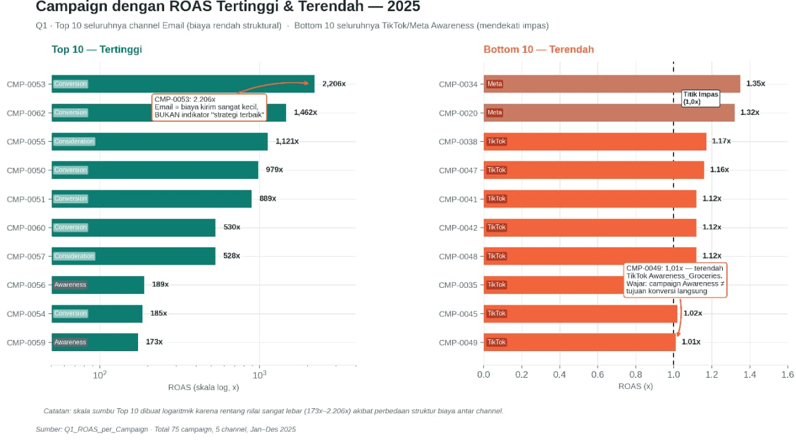
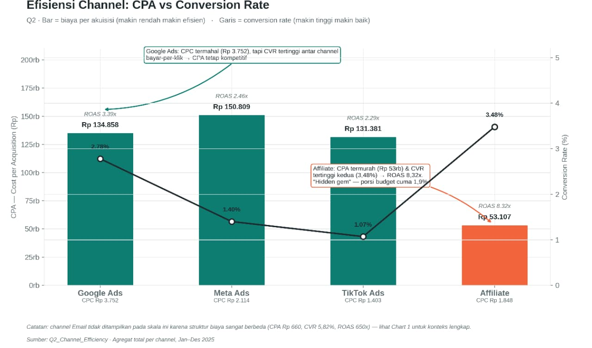
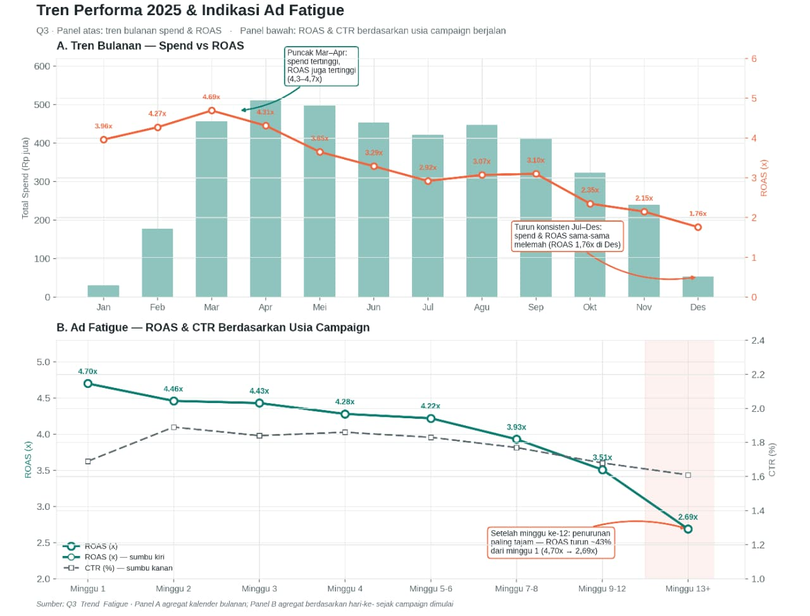
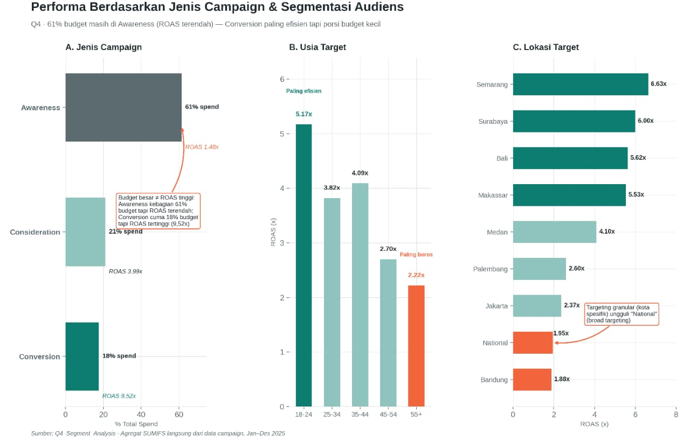
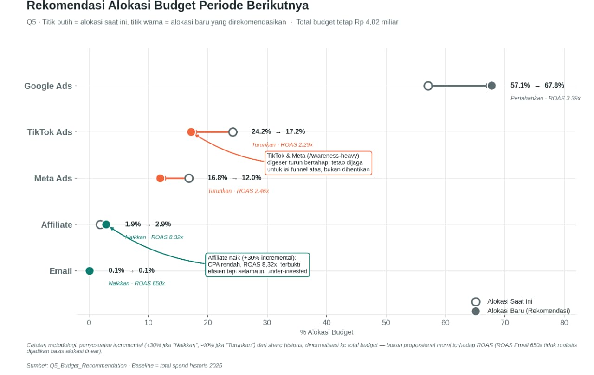

# Marketing Campaign ROAS (Return on Ad Spend) Analysis

Cross-channel marketing performance analysis and next-period budget allocation recommendations, based on historical data from 75 campaigns across 5 channels throughout January–December 2025.

---

## 📌 Overview

| Metric | Value |
|---|---|
| **Total Spend** | Rp 4.02 Billion |
| **Total Revenue** | Rp 13.78 Billion |
| **Overall ROAS** | 3.43x |
| **Number of Campaigns** | 75 |
| **Channels** | Google Ads, Meta Ads, TikTok Ads, Email, Affiliate |
| **Data Period** | January – December 2025 |

**Key takeaway:** The current budget structure is still overweight in the upper funnel (Awareness), which has historically been less efficient, while the lower funnel (Conversion) and the Affiliate channel — proven to be the most profitable — remain under-funded for growth. A measured budget shift has the potential to improve efficiency without increasing the total budget.

---

## 🛠️ Tools & Tech Stack

- **SQL** — extracting & aggregating campaign data from the database
- **Excel** — data cleaning, metric calculations (ROAS, CPA, CPC, CVR), and analyze data
- **Power BI** — visualization and cross-channel performance reporting
- **Claude AI** - accelerate project development and improve workflow efficiency
- **Data Visualization** — communicating insights to non-technical stakeholders

---

## 🔍 5 Key Findings

### Q1 — Highest & Lowest ROAS Campaigns

**Insight:** The top 10 ROAS campaigns all come from Email — not because it's the best strategy, but because of its very low delivery cost. The bottom 10 are all Awareness campaigns on TikTok/Meta, which is expected since their goal isn't direct conversion.

**Recommendations:**
- Scale up proven conversion-type Email campaigns (CMP-0053, 0062, 0055)
- Evaluate the 10 Awareness campaigns with ROAS ~1.0x — check reach/brand lift, not just ROAS
- Don't compare ROAS across channels apples-to-apples without cost context

### Q2 — Channel Efficiency: CPC, CPA & Conversion Rate

**Insight:** Outside of Email, **Affiliate** is the most efficient in real terms — the lowest CPA (Rp 53,107), a 3.48% conversion rate, and 8.32x ROAS. Google Ads has the highest CPC but its CPA remains competitive because its traffic is the most "purchase-intent" driven. TikTok is cheap per click but has the lowest conversion rate (1.07%).

**Recommendations:**
- Increase Affiliate's budget share — high efficiency, small allocation
- Keep Google Ads as the volume backbone, continue optimizing CPC
- TikTok: improve conversion rate (landing page, targeting, CTA) rather than chasing cheap CPC

### Q3 — Time Trends & Ad Fatigue Indicators

**Insight:** Performance peaked in March–April (ROAS 4.3–4.7x), then declined consistently through December (1.76x). There's a clear ad fatigue pattern: ROAS drops ~43% once a campaign has run for more than 12 weeks.

**Recommendations:**
- Implement a creative refresh cycle every 6–8 weeks for long-running campaigns
- Audit immediately any campaign running >12 weeks without a refresh
- Investigate whether the Oct–Dec decline is a deliberate decision or a market demand signal, before 2026 budget planning

### Q4 — Performance by Campaign Type & Segmentation

**Insight:** 61% of the budget goes to Awareness (lowest ROAS, 1.48x), while Conversion — the most efficient (9.52x ROAS) — only gets 18%. The 18–24 age group is the most efficient audience (5.17x ROAS); specific cities (Semarang, Surabaya, Bali) far outperform broad "National" targeting.

**Recommendations:**
- Gradually shift some budget from Awareness to Conversion (Awareness is still needed to fill the funnel)
- Prioritize the 18–24 audience & high-performing locations for new campaigns
- Reduce broad "National" targeting — replace it with a granular location approach

### Q5 — Next-Period Budget Allocation Recommendation

**Insight:** Email's ROAS (650x) was deliberately excluded from pure proportional allocation because the result would be unrealistic. The methodology used is an incremental adjustment (+30%/-40% of current share) based on ROAS signal vs. average — more credible to execute.

| Channel | Current Allocation | New Allocation | Action | Reason |
|---|---|---|---|---|
| Google Ads | 57.1% | 67.8% | Maintain | Volume backbone, stable 3.39x ROAS |
| TikTok Ads | 24.2% | 17.2% | Decrease | Lowest ROAS (2.29x), weak conversion rate |
| Meta Ads | 16.8% | 12.0% | Decrease | ROAS 2.46x, many underperforming Awareness campaigns |
| Affiliate | 1.9% | 2.9% | Increase | Lowest CPA, 8.32x ROAS — proven under-invested |
| Email | 0.1% | 0.1% | Increase | Efficient, but low ceiling — small historical base |

---

## ✅ Priority Action Checklist

- [ ] **Budget** — Gradually shift budget from TikTok & Meta to Google Ads and Affiliate, while monitoring the impact on awareness/top-of-funnel
- [ ] **Campaign Type** — Increase the budget share for Conversion-type campaigns across all channels (currently only 18% despite having the highest ROAS, 9.52x)
- [ ] **Creative** — Implement a creative refresh cycle every 6–8 weeks. Audit immediately any campaign running >12 weeks without a refresh
- [ ] **Targeting** — Prioritize the 18–24 audience and high-performing locations (Semarang, Surabaya, Bali, Makassar). Reduce broad "National" targeting

> All three recommendation pillars — channel allocation (Q5), creative refresh cycle (Q3), and segmentation focus (Q4) — are complementary and should ideally be executed together for optimal impact on overall ROAS.

---

## 👤 Author

Agi Agustian Davi - Entry Level Data Analyst
